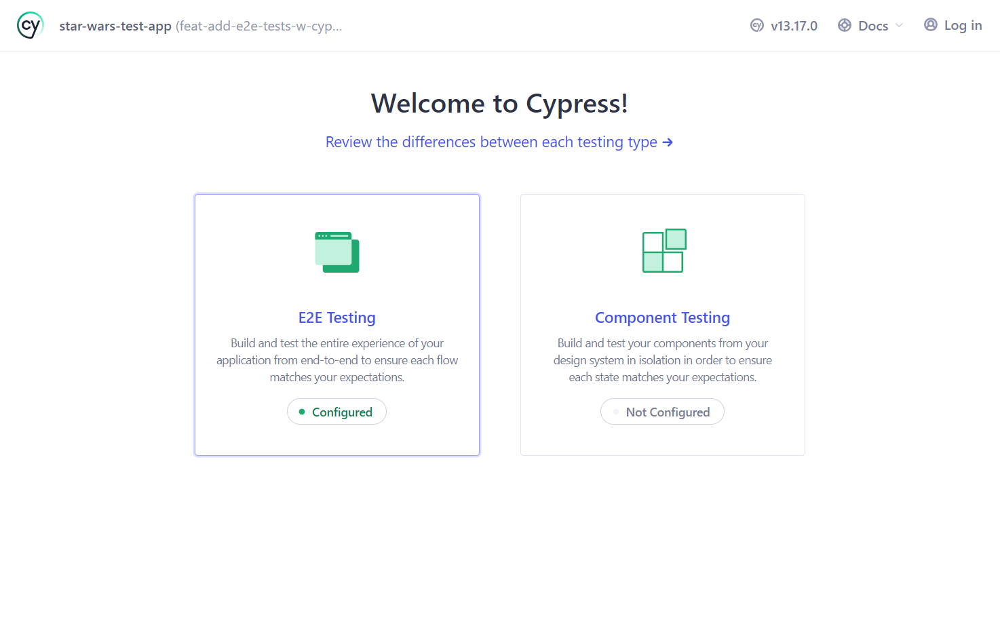
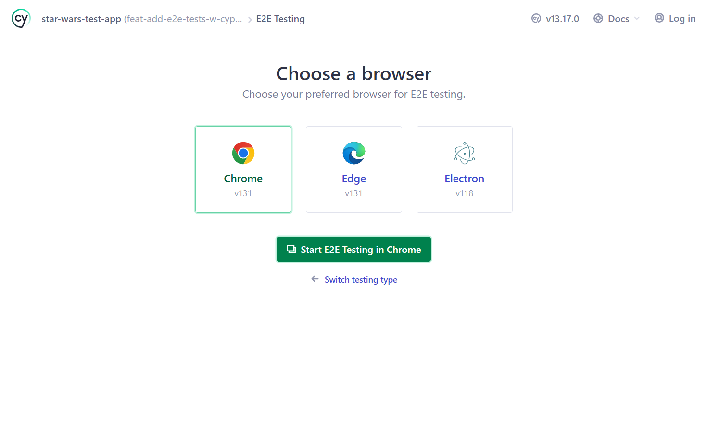
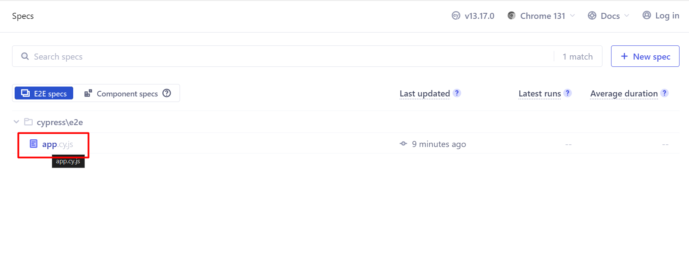
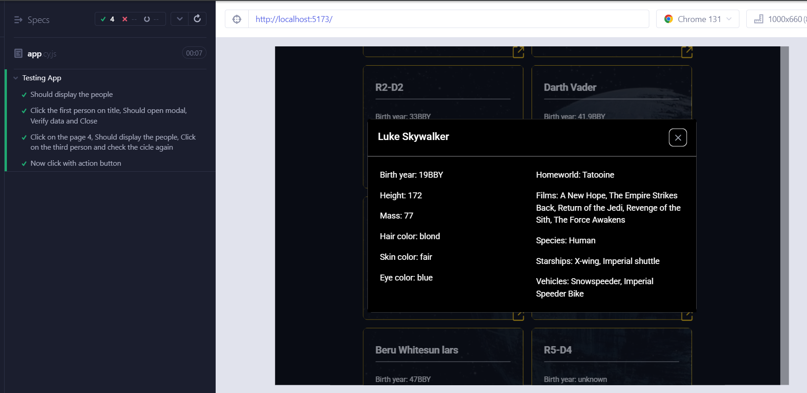

# Star Wars Test App

This is a technical test to evaluate knowledge.

## Table of contents

- [Overview](#overview)
  - [Screenshot](#screenshot)
- [About App](#about-app)
  - [Built with](#built-with)
  - [How to run](#how-to-run)
  - [How to run test suite](#how-to-run-test-suite)
- [Author](#author)

## Overview

### Screenshot

## About App

### Built with

- Html
- Javascript
- CSS
- [React](https://reactjs.org/) - JS library
- [Tailwind](https://tailwindcss.com/) - For styles
- [Flowbite React](https://www.flowbite-react.com/) - For styles
- [React Query](https://tanstack.com/query/v5) - For queries/pagination

### How to run

* Split a new terminal and run this:

* Install app using npm:

`npm install`

* Or using yarn:

`yarn install`

* Run app using npm:

`npm run dev`

* Or using yarn:

`yarn dev`

* Open: 

[http://localhost:5173/](http://localhost:5173/)

### How to run test suite

* Split a new terminal and run this while app is running:

`npm run e2e`

* Click on E2E Testing:

* Choose a browser and click a green button:

* Click on app.cy.js:

* Finish, a test suite is running:

* In cypress folder can see the tests:

`cypress\e2e\app.cy.js`

## Author

- Website - [Samuel Figueroa](https://sfweb.netlify.app/)